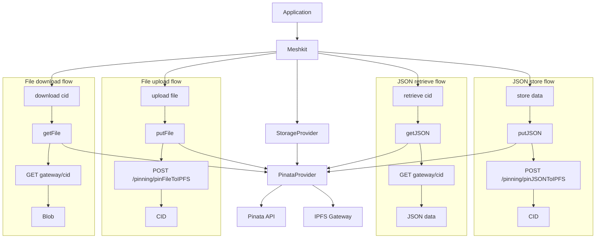

# Architecture Overview

MeshKit is organized as a small SDK layer over a storage provider interface.

## Overview

```text
Application
  -> Meshkit
    -> StorageProvider
      -> PinataProvider
        -> Pinata API
        -> IPFS gateway
```

The `Meshkit` class exposes developer-facing methods. Provider-specific HTTP behavior is isolated behind the `StorageProvider` interface.

## Architecture Diagram



## Core Components

| Component | Responsibility |
| --- | --- |
| `Meshkit` | Public SDK class. Provides `store`, `retrieve`, `upload`, `download`, `send`, `receive`, `revoke`, and `testConnection`. |
| `StorageProvider` | Interface for JSON, file, delete, and auth operations. |
| `PinataProvider` | Current provider implementation. Calls Pinata pinning APIs and reads from an IPFS gateway. |
| `MeshkitRecord<T>` | Standard metadata wrapper returned by write operations. |
| `MeshkitMessage` | Message payload model used by `send()` and `receive()`. |

## Provider Flow

### JSON Storage

```text
meshkit.store(data)
  -> provider.putJSON(data)
    -> POST /pinning/pinJSONToIPFS
      -> returns IpfsHash
```

### JSON Retrieval

```text
meshkit.retrieve(cid)
  -> provider.getJSON(cid)
    -> GET {gatewayUrl}/{cid}
      -> returns JSON
```

### File Upload

```text
meshkit.upload(file)
  -> provider.putFile(file)
    -> POST /pinning/pinFileToIPFS
      -> returns IpfsHash
```

### File Download

```text
meshkit.download(cid)
  -> provider.getFile(cid)
    -> GET {gatewayUrl}/{cid}
      -> returns Blob
```

## CID Normalization

For retrieval, download, and revoke operations, the Pinata provider accepts either a raw CID or a URL containing `/ipfs/`. Query strings and trailing slashes are removed before the provider calls the gateway or unpin endpoint.

## Current Provider Behavior

Although the `MeshkitConfig.provider` type includes `"pinata"`, `"filebase"`, and `"storacha"`, the current implementation always creates a `PinataProvider`.

Planned, not yet implemented:

- Filebase provider support
- Storacha provider support

## Related APIs

- [API Reference Overview](./api-reference.md)
- [store()](./api/store.md)
- [retrieve()](./api/retrieve.md)
- [upload()](./api/upload.md)
- [download()](./api/download.md)
